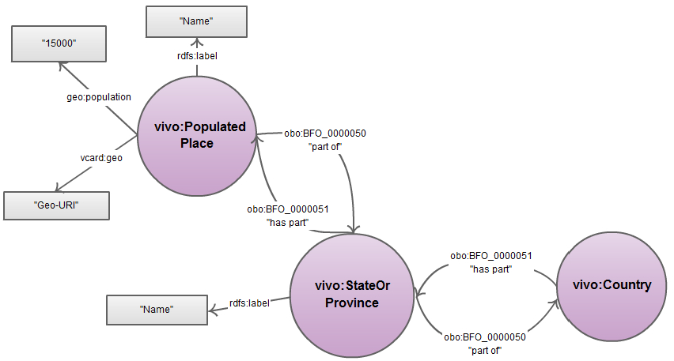
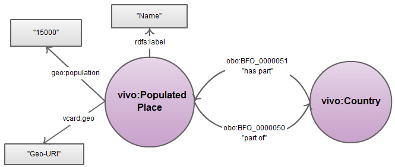

# Geographic data for use in VIVO

This dataset contains information about populated places and other geographical entities ready to use in current research information system [VIVO](http://vivoweb.org/). It was created by Elena Liventsova and Christian Hauschke for use in VIVO at University of Applied Sciences and Arts Hannover, Germany. It is successfully tested with VIVO 1.6 and 1.7

## German populated places
This dataset contains information about more than 7000 German populated places with more than 1000 inhabitants, including their population, geo-URI (coordinates), and links to Wikipedia and DBpedia.  Data is partially derived from [GeoNames.org](http://geonames.org).

## Populated Places worldwide
This dataset contains data of more than 8200 cities and towns worldwide with more than 50000 inhabitants (population, country, geo-URI (coordinates), and name of the populated place). Data is partially derived from [GeoNames.org](http://geonames.org).

## States of Germany
This dataset contains information about German states, including GND-links, and labels in German. Data is partially derived from [GeoNames.org](http://geonames.org).

## WorldOtherTerritories
This dataset contains information about some territories with disputed status.

Data is partially derived from [GeoNames.org](http://geonames.org).

# Contact

[Bibliothek der Hochschule Hannover](http://www.hs-hannover.de/bibl/kontakt/)

# Citation:
Christian Hauschke; Elena Liventsova (2014). Geodata : Populated places for VIVO. ZENODO. DOI: [10.5281/zenodo.13101](http://dx.doi.org/10.5281/zenodo.13101)
